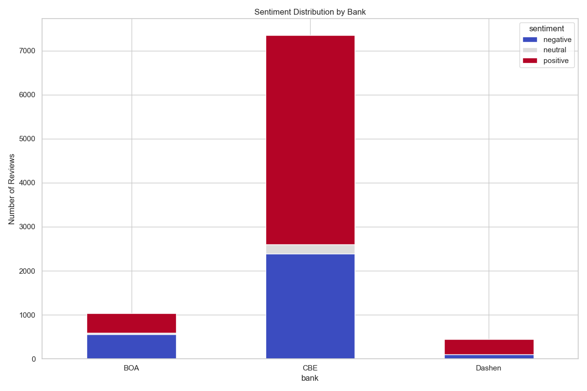
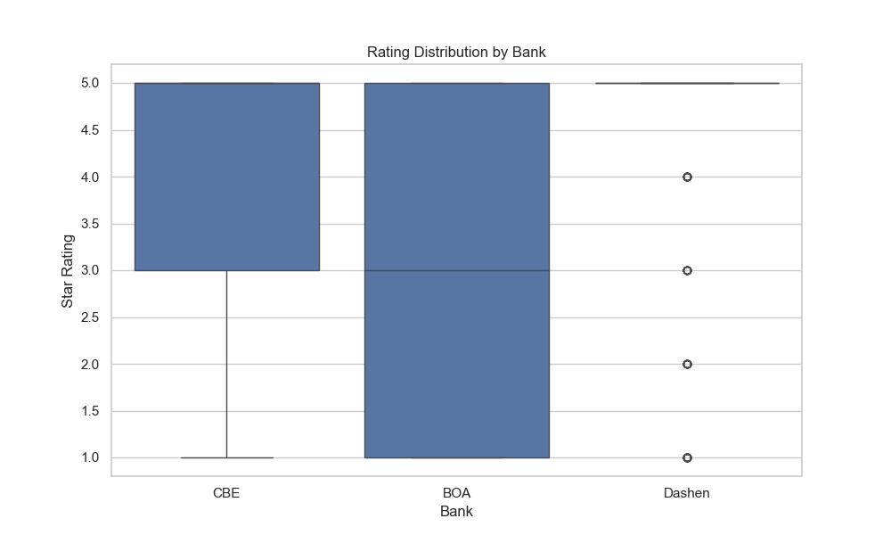
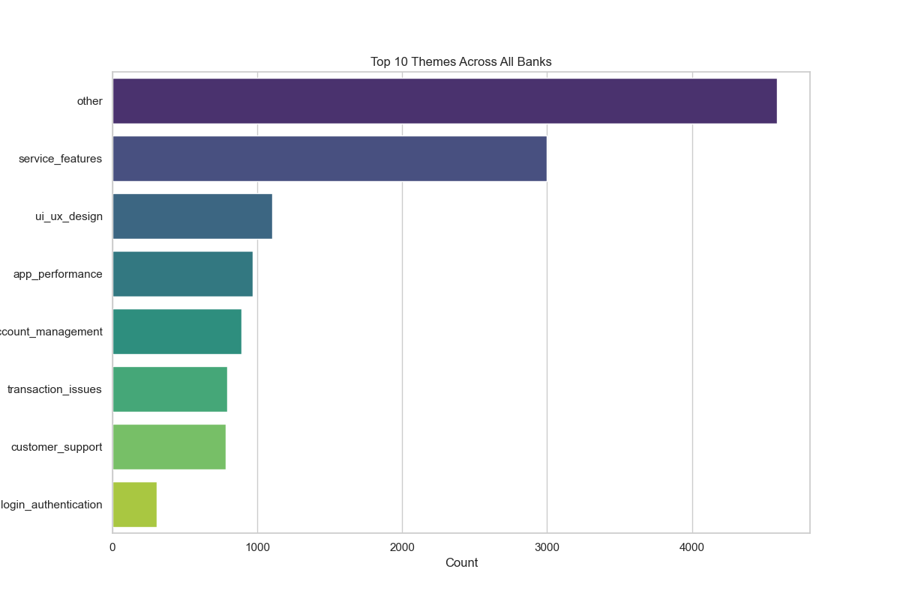
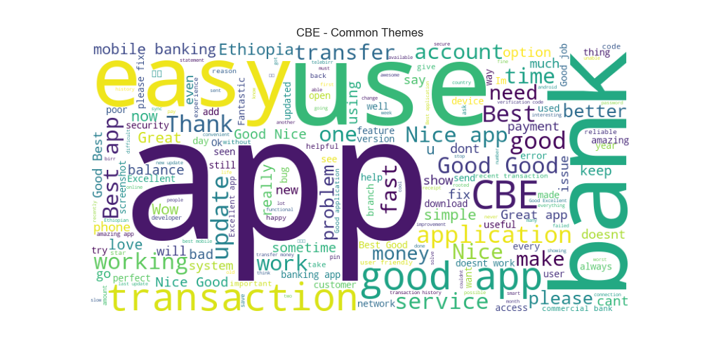
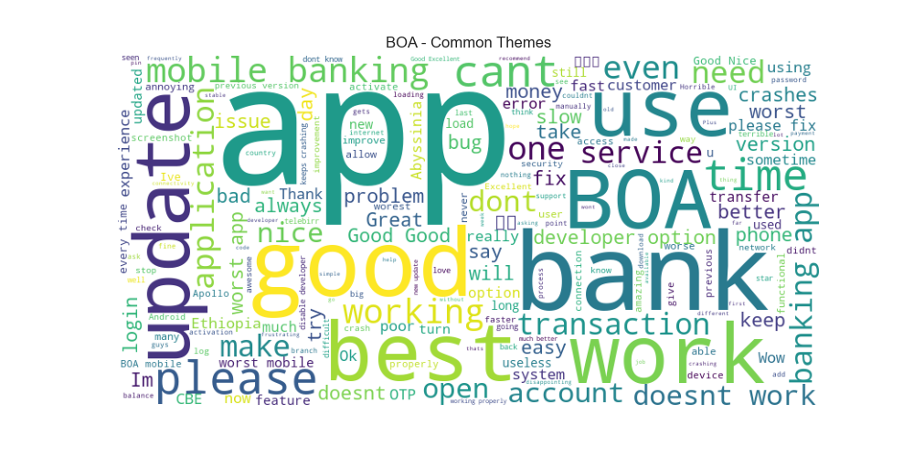
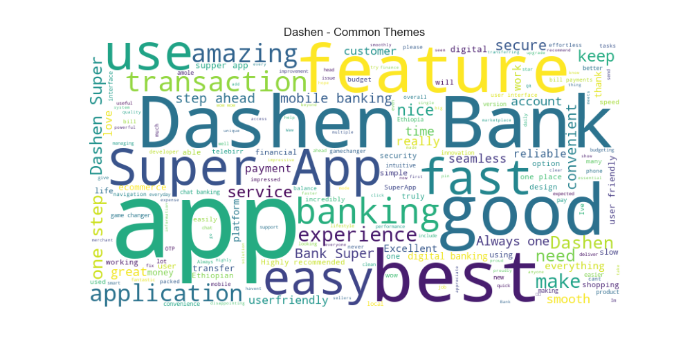

# Ethiopian Banks Mobile App Review Analysis - Final Report

## Executive Summary
This report analyzes user reviews from Google Play Store for three Ethiopian banks:
- Commercial Bank of Ethiopia (CBE)
- Bank of Abyssinia (BOA)
- Dashen Bank

The analysis reveals significant differences in user satisfaction, with CBE and Dashen receiving predominantly positive feedback, while BOA struggles with negative sentiment.

## Key Insights

### 1. Overall Satisfaction

- **CBE**: Highest positive sentiment (64.7%)
- **BOA**: Significant negative sentiment (54.2%)
- **Dashen**: Strong positive sentiment (76.1%)

### 2. Rating Distribution

- CBE maintains the highest average rating (4.4★)
- BOA has the lowest average rating (2.8★)
- Dashen shows consistent 4★ ratings

### 3. Key Themes

- **Transaction Issues**: Most common complaint across all banks
- **Login Problems**: Particularly prevalent for BOA
- **Feature Requests**: Most requested for Dashen

### Bank-Specific Analysis

#### Commercial Bank of Ethiopia (CBE)

- **Strengths**: Comprehensive features, reliable transactions
- **Weaknesses**: Occasional performance issues during peak hours
- **Recommendations**:
  - Optimize server capacity for peak usage
  - Add biometric login options

#### Bank of Abyssinia (BOA)

- **Strengths**: Wide range of banking services
- **Weaknesses**: Frequent login failures, app crashes
- **Recommendations**:
  - Prioritize authentication system overhaul
  - Improve app stability with performance patches

#### Dashen Bank

- **Strengths**: User-friendly interface, innovative features
- **Weaknesses**: Slow transaction processing
- **Recommendations**:
  - Implement top-requested features (e.g., bill splitting)
  - Optimize transaction processing speed

## Conclusion
All banks should focus on improving transaction reliability and performance. BOA requires immediate attention to address core functionality issues, while CBE and Dashen should focus on enhancing user experience and adding innovative features to maintain their competitive edge.

---

**Analysis Methodology**:
- Collected 8,840 reviews from Google Play Store
- Performed sentiment analysis using DistilBERT
- Identified themes through NLP keyword extraction
- Stored results in Oracle Database
